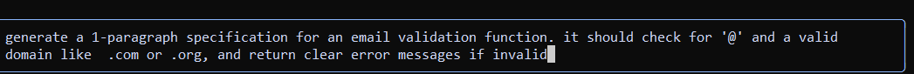
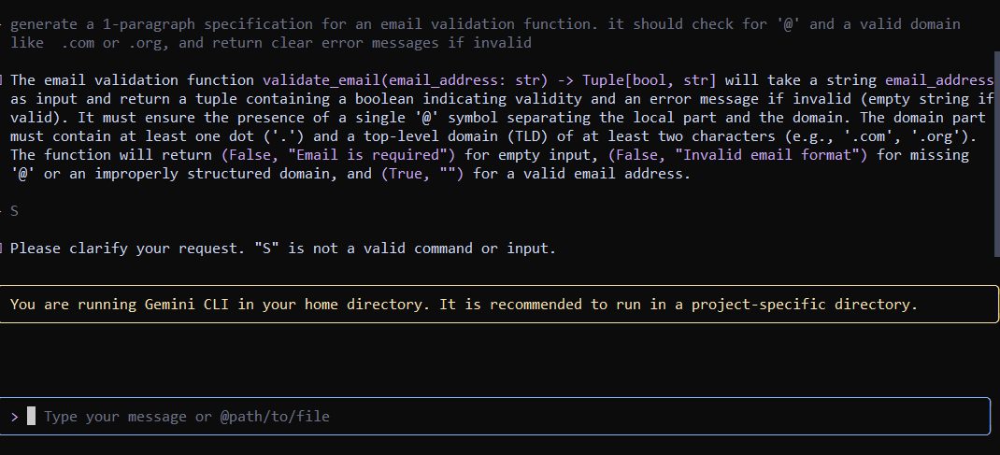

📁 Part A — Theory (Short Questions)

1. Nine Pillars Understanding

Q1: Why is using AI Development Agents (like Gemini CLI) for repetitive setup tasks better for your growth as a system architect?
Answer: Jab aap AI agents ka use karte ho repetitive tasks ke liye, to aapka time aur mental energy bachta hai. Aap routine kaam mein ulajhne ke bajaye complex system design aur planning par focus kar sakte ho. Ye approach aapko strategic aur efficient banata hai, jo ek strong system architect ke liye zaroori hai.

Q2: Explain how the Nine Pillars of AIDD help a developer grow into an M-Shaped Developer.
Answer: Nine Pillars har important skill aur mindset cover karte hain: jaise specification, collaboration, architecture thinking, automation, aur context handling. Ye pillars ek developer ko broad aur deep dono skills sikhaate hain, jis se wo multiple areas mein proficient aur innovative ho jata hai – M-Shaped Developer ka matlab hi ye hai: multiple competencies + deep understanding.

2. Vibe Coding vs Specification-Driven Development

Q1: Why does Vibe Coding usually create problems after one week?
Answer: Vibe Coding mein developers sirf apne instincts ya short-term ideas follow karte hain, proper specification aur planning ke bina. Initially sab smooth lagta hai, lekin jaise code grow karta hai, inconsistencies, bugs aur maintenance issues aate hain.

Q2: How would Specification-Driven Development prevent those problems?
Answer: Specification-Driven Development mein pehle clear plan aur rules define hote hain. Har feature aur module ka purpose aur behavior specified hota hai. Is se code consistent, scalable aur predictable banta hai, aur future me conflicts aur errors easily avoid ho jate hain.

3. Architecture Thinking

Q1: How does architecture-first thinking change the role of a developer in AIDD?
Answer: Architecture-first thinking se developer sirf code likhne wala nahi rehta, balki system ka designer ban jata hai. Wo modules, layers, dependencies aur data flows ko sochta hai, taake final product structured, maintainable aur efficient ho.

Q2: Explain why developers must think in layers and systems instead of raw code.
Answer: Raw code sirf small tasks handle karta hai, lekin layers aur systems mein sochne se developer larger picture aur long-term stability ko manage kar sakta hai. Ye approach bugs kam karti hai, scalability improve karti hai, aur future enhancements easily add kiye ja sakte hain.

📁 Part B — Practical Task (Screenshot Required)

1️⃣ CLI Prompt

2️⃣ AI-Generated Specification

📁 Part C — Multiple Choice Questions
1. What is the main purpose of Spec-Driven Development?

A. Make coding faster

B. Clear requirements before coding begins ✅

C. Remove developers

D. Avoid documentation

2. What is the biggest mindset shift in AI-Driven Development?

A. Writing more code manually

B. Thinking in systems and clear instructions ✅

C. Memorizing more syntax

D. Working without any tools

3. Biggest failure of Vibe Coding?

A. AI stops responding

B. Architecture becomes hard to extend ✅

C. Code runs slow

D. Fewer comments written

4. Main advantage of using AI CLI agents (like Gemini CLI)?

A. They replace the developer completely

B. Handle repetitive tasks so dev focuses on design & problem-solving ✅

C. Make coding faster but less reliable

D. Make coding optional

5. What defines an M-Shaped Developer?

A. Knows little about everything

B. Deep in only one field

C. Deep skills in multiple related domains ✅

D. Works without AI tools

🌟 Reflection
The AI era is changing everything about being a developer. With Nine Pillars, Spec-Driven Development, and AI agents, coding is no longer about typing it’s about thinking, planning, and designing systems. Architecture-first thinking helps me see the bigger picture, while AI handles repetitive work. The goal isn’t just writing code anymore; it’s building clean, scalable systems and growing into an M-Shaped developer with deep skills in multiple areas.